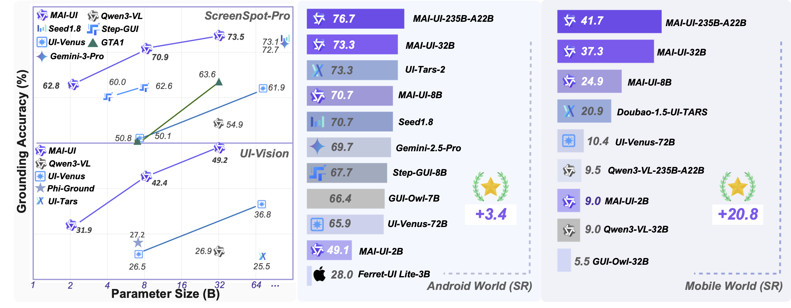
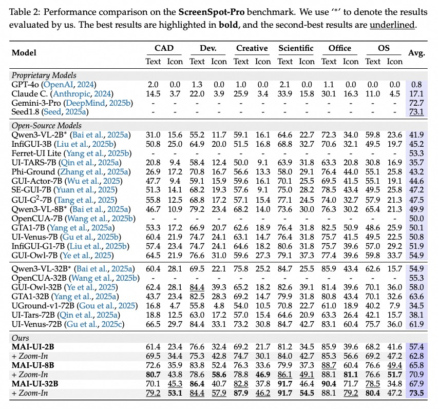
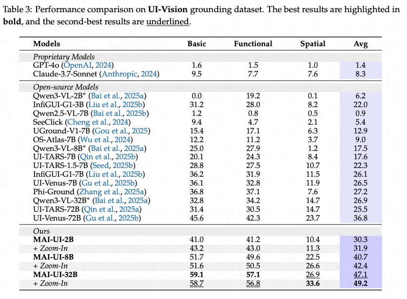
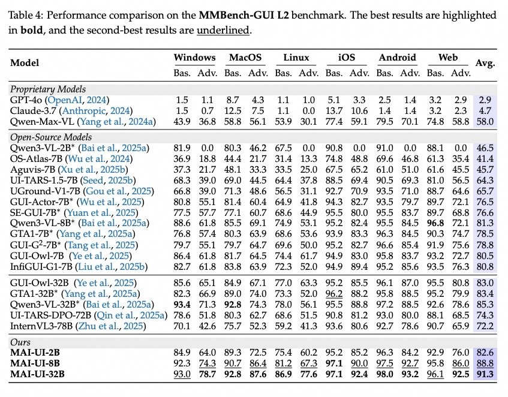
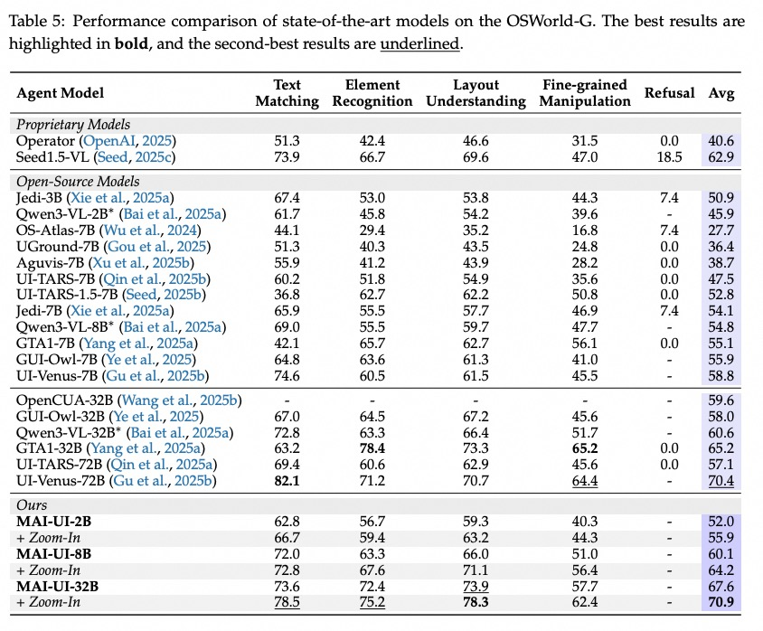
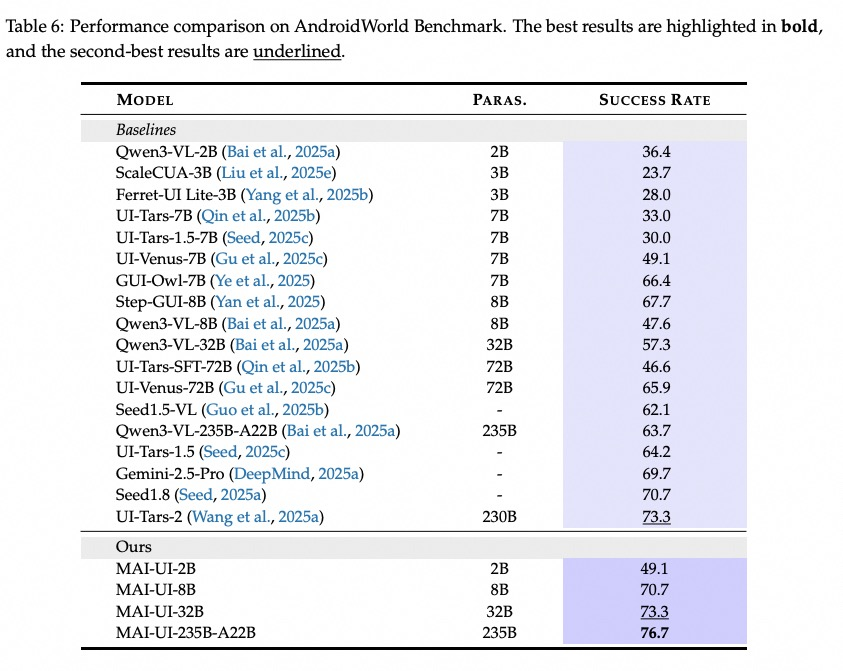
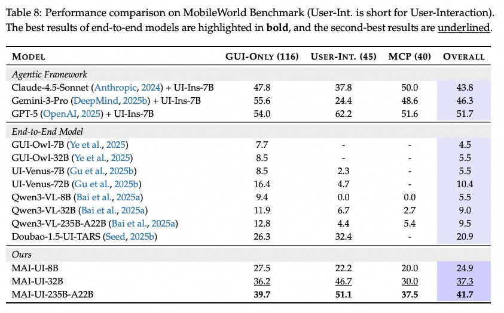
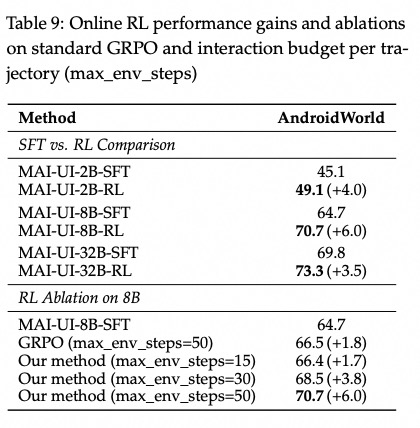
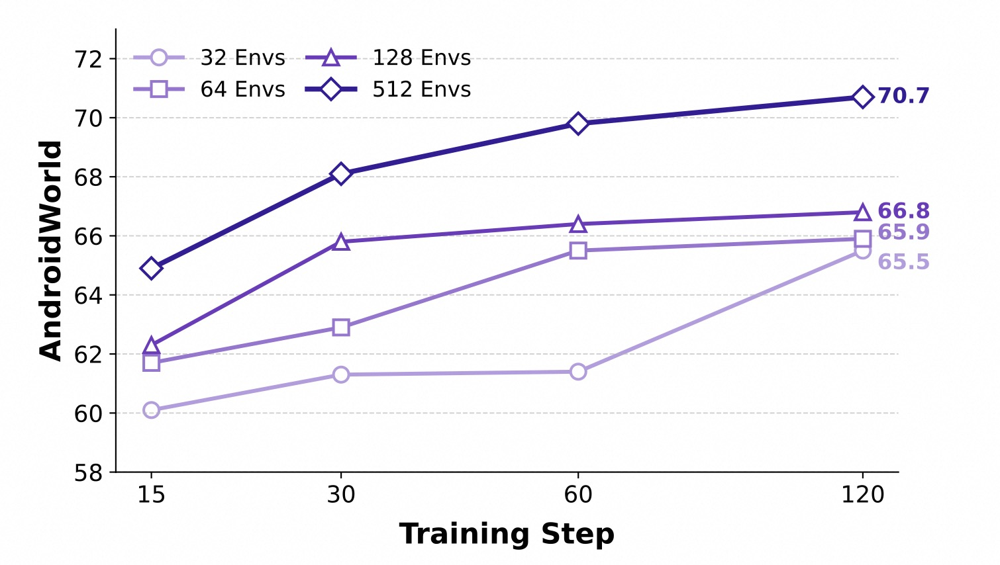
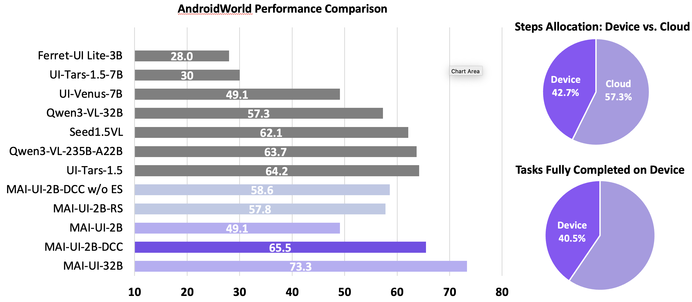

<p align="center">
  
</p>

<p align="center">
  <a href="https://arxiv.org/abs/2512.22047"></a>
  <a href="https://tongyi-mai.github.io/MAI-UI-blog/"></a>
  <a href="https://tongyi-mai.github.io/MobileWorld/"></a>
  <a href="https://huggingface.co/Tongyi-MAI"></a>
  <a href="https://www.modelscope.cn/organization/Tongyi-MAI"></a>
</p>

We present **MAI-UI**, a family of GUI agent foundation models spanning the full spectrum of sizes, including **2B**, **8B**, **32B**, and **235B-A22B** variants. Our core contribution includes:
- **🔧 Agent-user interaction and MCP augmentation**: enabling agent to interact with user and use MCP tools to complete the task.
- **☁️ Device–cloud collaboration system**: dynamically selecting on-device or cloud execution based on task execution state and data sensitivity.
- **📈 Dynamic RL Scaling**: large-scale reinforcement learning with scaling parallel environments (up to **512**) and context length (up to **50**).
- **🏆 State-of-the-Art Performance**: MAI-UI establishes new benchmark SOTA results across GUI grounding and navigation tasks.

<p align="center">
  
  <br>
  <em>Overview of MAI-UI performance</em>
</p>

## 📰 News
* **[2026-01-15]** 🥇 **New Record on AndroidWorld**: MAI-UI-235B takes #1 on the [AndroidWorld Leaderboard](https://docs.google.com/spreadsheets/d/1cchzP9dlTZ3WXQTfYNhh3avxoLipqHN75v1Tb86uhHo/edit?gid=0#gid=0) for pure-vision, end-to-end models with a 76.7% success rate.
* **[2026-01-13]** 🥇 **MAI-UI Sweeps ScreenSpot-Pro**: MAI-UI (32B, 8B, 2B) now ranks #1 in all size categories on the [ScreenSpot-Pro leaderboard](https://gui-agent.github.io/grounding-leaderboard/). We achieved record scores of 67.9%, 65.7%, and 57.4% respectively—notably reaching these benchmarks **without any zoom-in tricks**.
* **[2026-01-04]** 🤝 We're Hiring! We're actively looking for Research Scientists, Engineers, and Interns to work on foundational GUI agents and their applications. Interested candidates please send your resume to: yue.w@alibaba-inc.com
* **[2025-12-29]** 🏆 **New Leaderboard Record**: MAI-UI achieves a 41.7% success rate on the [MobileWorld](https://tongyi-mai.github.io/MobileWorld/#leaderboard) benchmark, setting a new record for end-to-end model performance!
* **[2025-12-29]** 📄 **Technical Report & Website**: Our technical report is now available on [arXiv](https://arxiv.org/abs/2512.22047), and the official project [website](https://tongyi-mai.github.io/MAI-UI-blog/) is live.
* **[2025-12-29]** 🤗 **Model Release**: We are excited to release the weights for [MAI-UI-8B](https://huggingface.co/Tongyi-MAI/MAI-UI-8B) and [MAI-UI-2B](https://huggingface.co/Tongyi-MAI/MAI-UI-2B) on Hugging Face.

## 📑 Table of Contents

- [🎥 Demo](#-demo)
- [🚀 Quick Start](#-installation--quick-start)
- [📝 Citation](#-citation)
- [📧 Contact](#-contact)
- [📄 License](#-license)


<!-- 
## 🏆 Results

MAI-UI establishes new state-of-the-art across GUI grounding and mobile navigation. 

- On grounding benchmarks, it reaches 73.5% on ScreenSpot-Pro, 91.3% on MMBench GUI L2, 70.9% on OSWorld-G, and 49.2% on UI-Vision, surpassing Gemini-3-Pro and Seed1.8 on ScreenSpot-Pro. 

<table align="center">
  <tr>
    <td align="center"><br/><b>ScreenSpot-Pro</b></td>
    <td align="center"><br/><b>UI-Vision</b></td>
  </tr>
  <tr>
    <td align="center"><br/><b>MMBench GUI L2</b></td>
    <td align="center"><br/><b>OSWorld-G</b></td>
  </tr>
</table>

- On mobile GUI navigation, it sets a new SOTA of 76.7% on AndroidWorld, surpassing UI-Tars-2, Gemini-2.5-Pro and Seed1.8. On MobileWorld, MAI-UI obtains 41.7% success rate, significantly outperforming end-to-end GUI models and competitive with Gemini-3-Pro based agentic frameworks. 
<table align="center">
  <tr>
    <td align="center"><br/><b>AndroidWorld</b></td>
    <td align="center"><br/><b>MobileWorld</b></td>
  </tr>
</table>

- Our online RL experiments show significant gains from scaling parallel environments from 32 to 512 (+5.2 points) and increasing environment step budget from 15 to 50 (+4.3 points).
<table align="center">
  <tr>
    <td align="center" width="50%"><br/><b>Online RL Results</b></td>
    <td align="center" width="50%"><br/><b>RL Environment Scaling</b></td>
  </tr>
</table>

- Our device-cloud collaboration framework can dynamically select on-device or cloud execution based on task execution state and data sensitivity. It improves on-device performance by 33% and reduces cloud API calls by over 40%.

<table align="center">
  <tr>
    <td align="center" width="50%"><br/><b>Device-cloud Collaboration</b></td>
  </tr>
</table> -->

## 🎥 Demo

### Demo 1 - Daily Life Scenario

Trigger `ask_user` for more information to complete the task.

<table align="center">
  <tr>
    <td align="center">
      
      <br/><b>User instruction: 去盒马买菜，买一份雪花牛肉卷、一份娃娃菜、一份金针菇，再随便买一个豆制品。对了，去日历中待办里检查下我老婆有什么要在盒马买的，我确认下要不要一起买</b>
    </td>
  </tr>
</table>

### Demo 2 - Navigation

Use `mcp_call` to invoke AMap tools for navigation.

<table align="center">
  <tr>
    <td align="center">
      
      <br/><b>User instruction: 我现在在阿里巴巴云谷园区，我要先去 招商银行取钱，再去城西银泰城。帮我规划公交地铁出行的路线，选一家在4公里以内的、用时最短的招商银行，两段行程总时间不要超过2小时，把规划行程记在笔 记中我一会看，标题为下午行程，内容为两段行程细节</b>
    </td>
  </tr>
</table>

### Demo 3 - Shopping

 Cross-apps collaboration to complete the task.

<table align="center">
  <tr>
    <td align="center">
      
      <br/><b>User instruction: Search “timeless earth 2026” on Xiaohongshu, save the one product image to your photo album, then use the saved image on Taobao to search for the same item and  add it to my shopping cart.</b>
    </td>
  </tr>
</table>

### Demo 4 - Work

Cross-apps collaboration to complete the task.

<table align="center">
  <tr>
    <td align="center">
      
      <br/><b>User instruction: 我需要紧急出差上海，帮我去12306查询现在最早从杭州西站去上海虹桥、有二等座票的班次，在钉钉前沿技术研讨群里把到达时间同步给大家，再把我和水番的会议日程改到明天同一时间，在群里发消息@他，礼貌解释因为临时出差调整会议时间，询问他明天是否有空</b>
    </td>
  </tr>
</table>

### Demo 5 - Device-only

Device-cloud collaboration for simple tasks, no need cloud model invocation.

<table align="center">
  <tr>
    <td align="center">
      
      <br/><b>User Instruction: 去飞猪查询12月25日去，28日回，杭州到三亚的往返机票</b>
    </td>
  </tr>
</table>

### Demo 6 - Device-cloud Collaboration

Device-cloud collaboration for complex tasks, requiring cloud model invocation when the task is beyond the device models capabilities.

<table align="center">
  <tr>
    <td align="center">
      
      <br/><b>User Instruction: 去淘票票给我买一张25号下午的疯狂动物城2的电影票，选亲橙里的电影院，中间的座位，加一份可乐和爆米花的单人餐，停在最后的订单界面</b>
    </td>
  </tr>
</table>

## 🚀 Installation & Quick Start

### Step 1: Clone the Repository

```bash
git clone https://github.com/Tongyi-MAI/MAI-UI.git
cd MAI-UI
```

### Step 2: Start Model API Service with vLLM

Download the model from HuggingFace and deploy the API service using vLLM:

HuggingFace model path:  
- [MAI-UI-2B](https://huggingface.co/Tongyi-MAI/MAI-UI-2B)
- [MAI-UI-8B](https://huggingface.co/Tongyi-MAI/MAI-UI-8B)

Deploy the model using vLLM:


```bash
# Install vLLM
pip install vllm==0.11.0  # vllm==0.11.0 and transformers>=4.57.0

# Start vLLM API server (replace MODEL_PATH with your local model path or HuggingFace model ID)
python -m vllm.entrypoints.openai.api_server \
    --model <huggingface_model_path> \
    --served-model-name MAI-UI-8B \
    --host 0.0.0.0 \
    --port 8000 \
    --tensor-parallel-size 1 \
    --trust-remote-code
```

> 💡 **Tips:**
> - IMPORTANT: Must use `VLLM=0.11.0`
> - Adjust `--tensor-parallel-size` based on your GPU count for multi-GPU inference
> - The model will be served at `http://localhost:8000/v1`

### Step 3: Install Dependencies

```bash
pip install -r requirements.txt
```

### Step 4: Run cookbook notebooks

We provide two notebooks in the `cookbook/` directory:

#### 4.1 Grounding Demo

The `grounding.ipynb` demonstrates how to use the MAI Grounding Agent to locate UI elements:

```bash
cd cookbook
jupyter notebook grounding.ipynb
```

Before running, update the API endpoint in the notebook:

```python
agent = MAIGroundingAgent(
    llm_base_url="http://localhost:8000/v1",  # Update to your vLLM server address
    model_name="MAI-UI-8B",                   # Use the served model name
    runtime_conf={
        "history_n": 3,
        "temperature": 0.0,
        "top_k": -1,
        "top_p": 1.0,
        "max_tokens": 2048,
    },
)
```

#### 4.2 Navigation Agent Demo

The `run_agent.ipynb` demonstrates the full UI navigation agent:

```bash
cd cookbook
jupyter notebook run_agent.ipynb
```

Similarly, update the API endpoint configuration:

```python
agent = MAIUINaivigationAgent(
    llm_base_url="http://localhost:8000/v1",  # Update to your vLLM server address
    model_name="MAI-UI-8B",                   # Use the served model name
    runtime_conf={
        "history_n": 3,
        "temperature": 0.0,
        "top_k": -1,
        "top_p": 1.0,
        "max_tokens": 2048,
    },
)
```

---

## 📝 Citation

If you find this project useful for your research, please consider citing our works:

```bibtex
@misc{zhou2025maiuitechnicalreportrealworld,
      title={MAI-UI Technical Report: Real-World Centric Foundation GUI Agents}, 
      author={Hanzhang Zhou and Xu Zhang and Panrong Tong and Jianan Zhang and Liangyu Chen and Quyu Kong and Chenglin Cai and Chen Liu and Yue Wang and Jingren Zhou and Steven Hoi},
      year={2025},
      eprint={2512.22047},
      archivePrefix={arXiv},
      primaryClass={cs.CV},
      url={https://arxiv.org/abs/2512.22047}, 
}
@misc{chen2025uiinsenhancingguigrounding,
      title={UI-Ins: Enhancing GUI Grounding with Multi-Perspective Instruction-as-Reasoning}, 
      author={Liangyu Chen and Hanzhang Zhou and Chenglin Cai and Jianan Zhang and Panrong Tong and Quyu Kong and Xu Zhang and Chen Liu and Yuqi Liu and Wenxuan Wang and Yue Wang and Qin Jin and Steven Hoi},
      year={2025},
      eprint={2510.20286},
      archivePrefix={arXiv},
      primaryClass={cs.CV},
      url={https://arxiv.org/abs/2510.20286}, 
}
@misc{kong2025mobileworldbenchmarkingautonomousmobile,
      title={MobileWorld: Benchmarking Autonomous Mobile Agents in Agent-User Interactive, and MCP-Augmented Environments}, 
      author={Quyu Kong and Xu Zhang and Zhenyu Yang and Nolan Gao and Chen Liu and Panrong Tong and Chenglin Cai and Hanzhang Zhou and Jianan Zhang and Liangyu Chen and Zhidan Liu and Steven Hoi and Yue Wang},
      year={2025},
      eprint={2512.19432},
      archivePrefix={arXiv},
      primaryClass={cs.AI},
      url={https://arxiv.org/abs/2512.19432}, 
}
```

## 📧 Contact

For questions and support, please contact:

- **Hanzhang Zhou**  
  Email: [hanzhang.zhou@alibaba-inc.com](mailto:hanzhang.zhou@alibaba-inc.com)

- **Xu Zhang**  
  Email: [hanguang.zx@alibaba-inc.com](mailto:hanguang.zx@alibaba-inc.com)

- **Yue Wang**  
  Email: [yue.w@alibaba-inc.com](mailto:yue.w@alibaba-inc.com)

## 📄 License

MAI-UI Mobile is a foundation GUI agent developed by Alibaba Cloud and licensed under the Apache License (Version 2.0).

This product contains various third-party components under other open source licenses. 
See the NOTICE file for more information.

